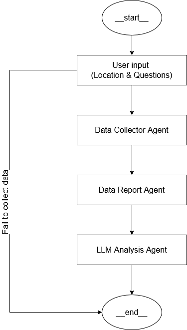

# Weather Forecast Multi-Agent System (MAS)

A production-style **3-agent weather forecasting system** built using **LangGraph**, designed to collect weather data from multiple APIs, reconcile inconsistencies, generate alerts, and provide **LLM-powered analysis and recommendations**.
---

## Key Features

- Multi-source weather data acquisition  
- Deterministic statistical analysis and consensus building  
- LLM-powered reasoning, Q&A, and recommendations  
- Structured, explainable outputs  
- Modular and extensible agent architecture  

---

## High-Level Architecture

The system is organized around three cooperating agents coordinated via a LangGraph state machine.


---

## Agent Responsibilities

### Agent 1 – Data Acquisition

**Purpose**
- Collect raw weather data from multiple providers
- Normalize responses into a common schema

**Responsibilities**
- Query multiple APIs (OpenWeather, WeatherAPI, Visual Crossing)
- Handle API failures independently
- Attach source metadata and errors
- Output structured `WeatherData` objects

**Outputs**
- `raw_weather_data[]`
- Source-level confidence indicators

---

### Agent 2 – Weather Data Report

**Purpose**
- Convert raw data into actionable insights

**Responsibilities**
- Aggregate values across sources
- Compute:
  - temperature ranges and averages
  - humidity and wind statistics
  - consistency and variance
- Detect anomalies and severe conditions
- Generate alerts with severity levels

**Outputs**
- `weather_report`
- `analysis_summary`
- `detailed_insights`
- `weather_alerts[]`

---

### Agent 3 – LLM Analysis & Q&A

**Purpose**
- Interpret analysis results for humans

**Responsibilities**
- Generate natural-language summaries
- Answer user questions
- Provide recommendations
- Assess confidence and data quality

**Outputs**
- `llm_response`


---

## Shared State Model

All agents operate on a shared immutable `AgentState`.

**Key fields**
- `location`, `request_id`, `user_question`
- `agent1_status`, `agent2_status`, `agent3_status`
- `raw_weather_data[]`
- `weather_consensus`
- `weather_alerts[]`
- `analysis_summary`
- `detailed_insights`
- `llm_response`
- `execution_time_ms`
- `errors[]`

This ensures:
- Full traceability
- Deterministic debugging
- Clean agent boundaries

---

## Execution Flow

1. User provides location (default: New York, NY, USA) and optional question (default: Should I go out?)
2. Orchestrator initializes LangGraph  
3. Initial `AgentState` is created  
4. Agent 1 fetches and normalizes data  
5. Agent 2 combine and builds data report  
6. Agent 3 reasons, answers, and evaluates confidence  
7. Final response formatted and returned  

---

## Output Structure

Final responses include:
- Workflow status and execution timing
- Agent completion states
- Weather summary
- Alerts with severity and recommendations
- LLM-generated insights and answers
- Raw data preview

---

## Project Structure

```
.
├── agents/
│   ├── __init__.py
│   ├── data_acquition.py
│   ├── llm_chat.py
│   └── weather_data_report.py   
│   
├── config/
│   ├── __init__.py
│   └── settings.py
│
├── utils/
│   ├── __init__.py
│   ├── llm_client
│   │   ├── __init__.py
│   │   ├── base_client.py
│   │   ├── gemini_client.py
│   │   ├── groq_client.py
│   │   ├── openai_client.py
│   │   └── multi_provider.py
│   │ 
│   └── weather_clients
│       ├── __init__.py
│       ├── base_client.py
│       ├── openweather_client.py
│       ├── visualcrossing_client.py
│       └── weatherapi_client.py
│
├── workflows/
│   ├── __init__.py
│   ├── orchestrator.py
│   ├── weather_workflow.py
│   └── state.py
│
├── main.py
│
├── LICENSE
├── requirement.txt
├── .env
└── README.md
```

---

## Configuration

Environment-based configuration via `Config.from_env()`.

### Weather APIs
```
OPENWEATHER_API_KEY=...
WEATHERAPI_KEY=...
VISUALCROSSING_API_KEY=...
```

### LLM Providers
```
OPENAI_API_KEY=...
GROQ_API_KEY=...
```

At least one LLM provider must be available.

---

## Running the System

```
python app/main.py
```

**Example**
```
python app/main.py "London" "Should I bring an umbrella?"
```

---

## Design Principles

- Clear separation of concerns between agents
- Deterministic analysis before LLM reasoning
- Confidence-aware decision making
- Easy extensibility (add agents or tools)
